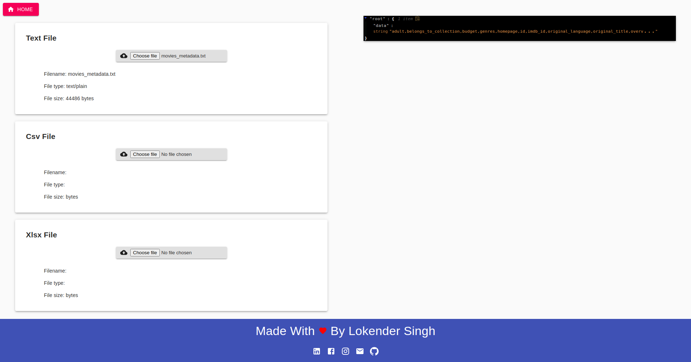
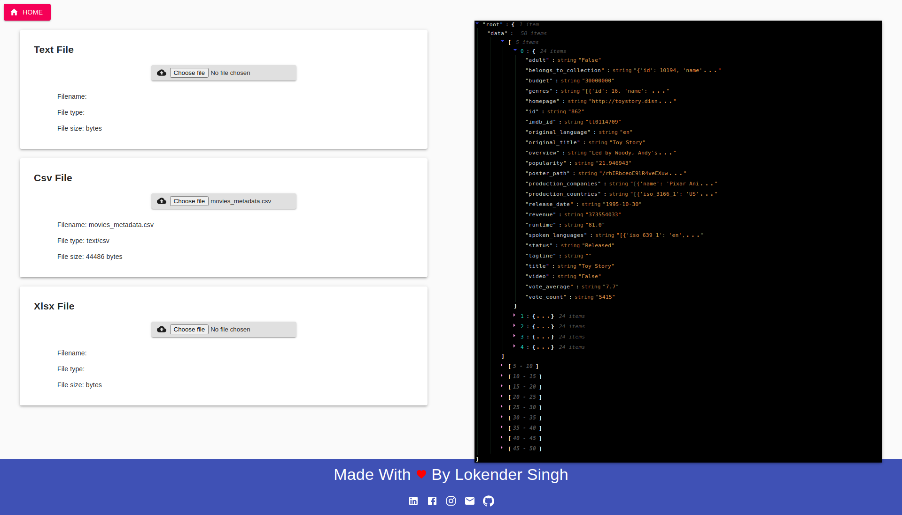
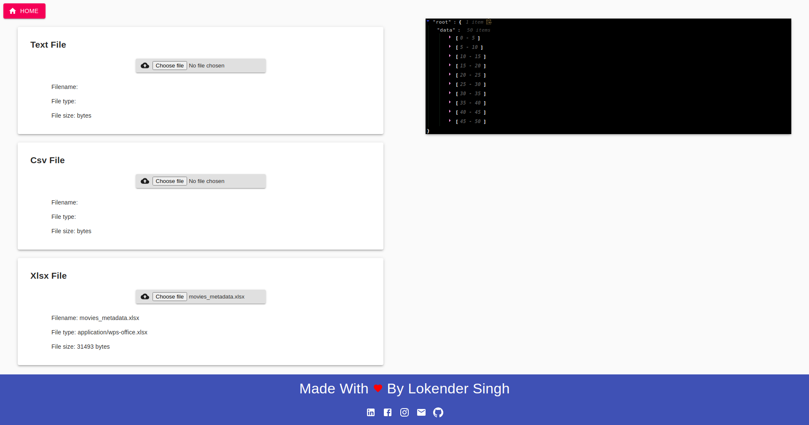

# Simple_Mern_Short_Demo_File_Read
It's a simple example or demo project to demonstrate to read files like xlsx, csv, txt 
it's made by using following technologies
- ReactJS
- NodeJS
- ExpressJS
- MaterialUI

## How To Run 
```
- Server
    1. Move To Server Directory
    cd server/

    2. Install Packages
    yarn

    3. start Server App
    nodemon src/server.js 

- Client    

    1. Move To Client Directory
    cd Client/

    2. Install Packages
    yarn

    3. start App
    yarn start
```

## Tasks Completed

1. Homepage
2. Text Component
3. CSV Component
4. XLSX Component
5. Basic Server to handle files


## Demo ScreenShots

- Text File
  

- CSV File
  

- XLSX File
  
